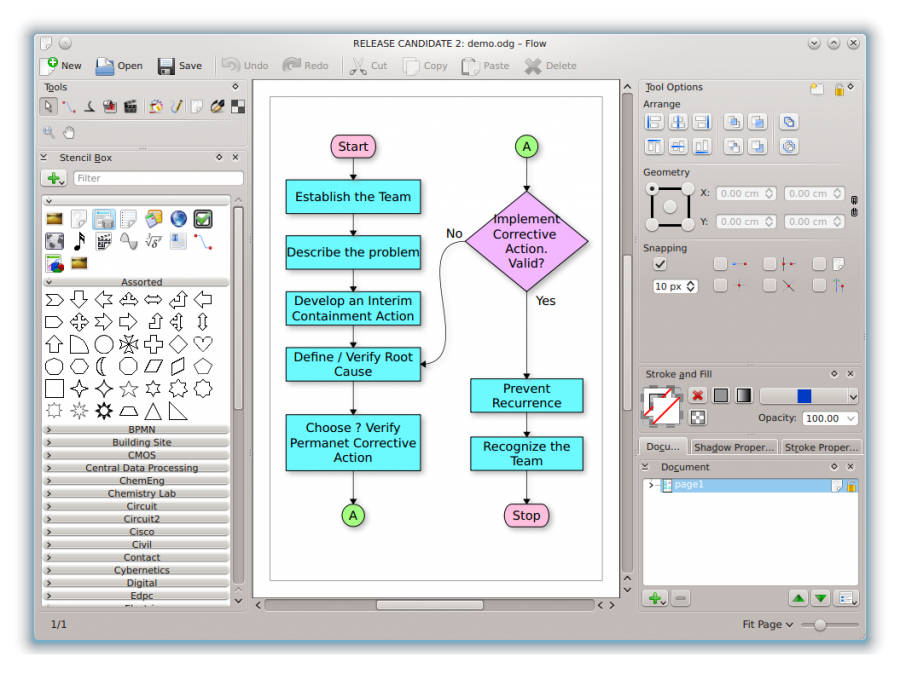

Software untuk membuat diagram di Cloud diantaranya ada https://draw.io, sementara itu versi non-cloud yang mempunyai fungsionalitas sama diantaranya adalah Microsoft Visio, Calligra Flow, serta Dia. 
===========================================================================================================

Overview Layanan SaaS Microsoft Visio :
***************************************

Microsoft Visio (atau sering disebut Visio) adalah sebuah program aplikasi komputer yang sering digunakan untuk membuat diagram, diagram alir (flowchart), brainstorm, dan skema jaringan yang dirilis oleh Microsoft Corporation. Aplikasi ini menggunakan grafik vektor untuk membuat diagram-diagramnya. 

	* Microsoft Visio ini termasuk kedalam layanan SaaS (Software as a Service) dikarenakan pada Microsoft Visio ini pengguna hanya perlu menggunakan aplikasi tersebut tanpa harus mengerti dan mengurus bagaimana data disimpan atau bagaimana aplikasi tersebut di maintenance, karena hal tersebut merupakan service yang disediakan penyedia layanan. 

	* Layanan SaaS Yang Mempunyai Fungsionalitas Seperti Microsoft Visio yaitu : Microsoft Office 365, Adobe Suite.

	* Contoh, layanan email publik (Gmail, YahooMail, Hotmail), social network (Facebook, Twitter, LinkedIn) instant messaging (Yahoo Messenger, Skype, Line, WhatsApp).

Overview Layanan SaaS Calligra Flow :
*************************************

Calligra Flow adalah aplikasi diagram dan flowchart yang mudah digunakan dengan integrasi yang kuat ke aplikasi Calligra lainnya. Ini memungkinkan Anda untuk membuat diagram jaringan, bagan organisasi, diagram alur, dan lainnya.

Dari Uraian Gambar Diatas Yang Dimana Pada Alur Calligra Flow sebagai berikut :

* Start (Mulai)
* Langkah atau alur pertama yaitu membentuk tim.
* Langkah atau alur kedua yaitu menjelasakan masalah.
*Langkah atau alur ketiga yaitu mengembangkan tindakan penahanan sementara.
* Langkah atau alur keempat yaitu verifikasi akar penyebab. Dengan Memilih? verifikasi permanet tindakan korektif.
* Langkah atau alur kelima yaitu jika pernyataan tidak sesuai maka dilakukan tindakan korektif. Valid?
* Langkah atau alur keenam yaitu jika pernyataan sesuai makan dilakukan pencegahan pengeluaran.
* Langkah atau alur ketujuh yaitu mengenalin tim.
* Stop (selesai). 

Calligra Flow ini termasuk kedalam layanan SaaS (Software as a Service) dikarenakan pada Microsoft Visio ini pengguna hanya perlu menggunakan aplikasi tersebut tanpa harus mengerti dan mengurus bagaimana data disimpan atau bagaimana aplikasi tersebut di maintenance, karena hal tersebut merupakan service yang disediakan penyedia layanan. 

Layanan SaaS Yang Mempunyai Fungsionalitas Seperti Calligra Flow yaitu : DFD (Data Flow Diagram), ERD (Entity Relationship Diagram).

Overview Layanan SaaS Dia Diagram Editor :
******************************************

Dia adalah perangkat lunak gratis yang tersedia di bawah ketentuan GNU GNU General Public License , GPLv2.

Repositori Bentuk Dia

Diashapes
Diashapes adalah alat kecil untuk mengunduh dan memasang bentuk

dia-bentuk
dia-bentuk adalah paket Debian dengan semua lembar dan bentuk dari Dia Shape Repository.

Memperluas dan menyesuaikan Dia
* Cara membuat bentuk baru: * .shape file XML

* Deskripsi langkah-demi-langkah tentang cara menambahkan bentuk ke kotak alat Dia.

* Cara menyesuaikan lembar dia: menambahkan, menghapus, menyalin & memindahkan bentuk

* Repositori lembar bentuk n ': http://dia-installer.de/shapes.html

Dia ini termasuk kedalam layanan SaaS (Software as a Service) dikarenakan pada Microsoft Visio ini pengguna hanya perlu menggunakan aplikasi tersebut tanpa harus mengerti dan mengurus bagaimana data disimpan atau bagaimana aplikasi tersebut di maintenance, karena hal tersebut merupakan service yang disediakan penyedia layanan. 

Layanan SaaS Yang Mempunyai Fungsionalitas Seperti Dia yaitu : Use Case Diagram, Relasi Antar Tabel.

========================================================================================================
Created by : Maria Tri Astuti (175610056)
========================================================================================================

