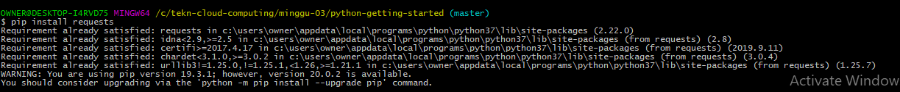
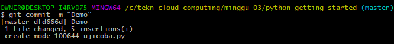
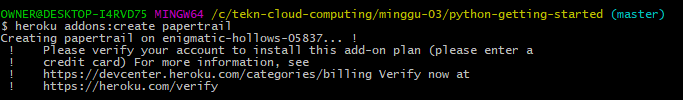

LATIHAN TCC MINGGU-03
=====================

* Heroku
=========

* Membuat Aplikasi Baru Melalui Dashboard
=========================================

Klik menu create new app, lalu isikan app name lalu pilih create app seperti tampilan dibawah ini :

Pilih Menu Open App sbb :

Link : https://dashboard.heroku.com/apps/latihan-02

Tampilan :

* Kerjakan Getting Started on Heroku with Python, tidak perlu mengerjakan heroku pg:psql jika tidak ada PostgreSQL di lokal.
=======================================================================================================

Menginstal Antarmuka Baris Perintah Heroku (CLI) :

Gunakan heroku loginperintah untuk masuk ke Heroku CLI:

Perintah ini membuka browser web Anda ke halaman login Heroku. Jika browser Anda sudah masuk ke Heroku, cukup klik Log intombol yang ditampilkan di halaman.

Prepare The App

Buat aplikasi di Heroku :

Melakukan push pada heroku :

Membuka Heroku :

Sehingga tampilannya sebagai berikut :

View Log 
Melihat informasi tentang menjalankan aplikasi menggunakan salah satu perintah logging , heroku logs --tail:

Skala Aplikasi 
Memeriksa berapa banyak dyno yang berjalan menggunakan psperintah :

Mengubah jumlah dino yang sedang berjalan :

Menginstal dependensi Python yang sesuai menggunakan pip install –rperintah :

Melakukan list :

Menjalankan Aplikasi :

Menggunakan lokal heroku local, yang diinstal sebagai bagian dari CLI Heroku, Jika  menggunakan sistem Microsoft Windows, jalankan ini:

Server web lokal kemudian akan mulai:

Install Requests :

Heroku Lokal :

Add :

Lakukan Commit :

Lakukan Push :

Membuka Heroku :

Menyediakan add-on logging papertrail :

Konfigurasi Aplikasi :

Add On papertrail :

Maria Tri Astuti (175610056)